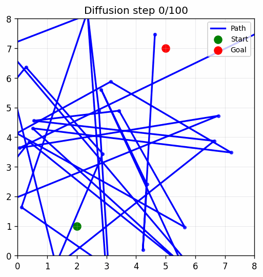
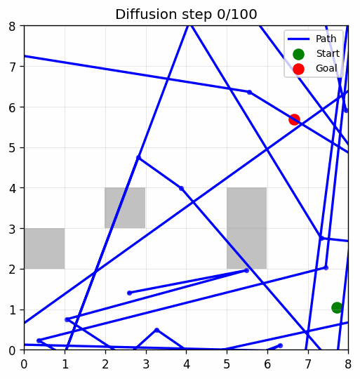
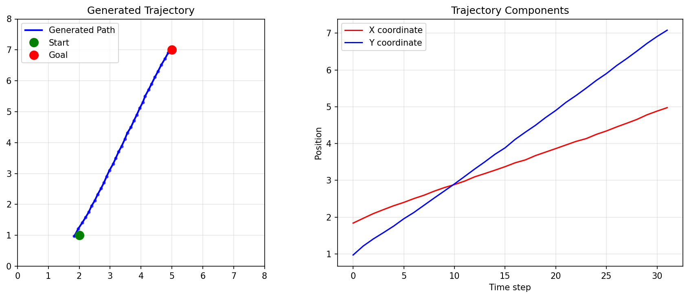
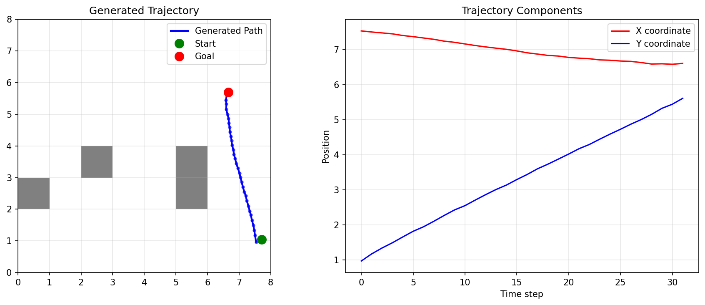
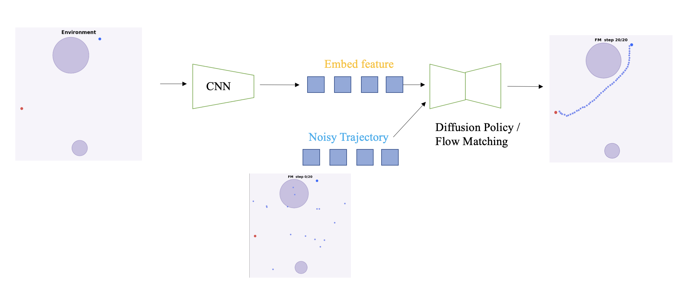

# Diffusion Path Planning in 2D

**2D trajectory generation using a conditional diffusion model**, producing smooth and collision-free paths in environments with circular or rectangular obstacles.

Two modes are supported:

| Mode | Map | Obstacle type | Encoder |
|------|-----|---------------|---------|
| `original` | 8×8 binary grid | Rectangles | ViT + MLP |
| `continuous` | 64×64 3-channel image | Circles (continuous) | CNN |

## Results (original mode)

| No Obstacle | With Obstacle |
|-------------|----------------|
|  |  |
|  |  |

> These examples show out-of-distribution scenarios (single obstacle or no obstacle) that the model was never trained on.

## Model Architecture



A **conditional 1D U-Net** denoises a noisy trajectory, conditioned on the environment via FiLM modulation.

### Original mode
- **MLP** encodes the concatenated start + goal positions
- **ViT** encodes the 8×8 binary obstacle map
- Both embeddings are concatenated and used as global conditioning

### Continuous mode
- Start and goal are embedded as **Gaussian blobs** directly into the map (channels 1 and 2)
- A **CNN** encodes the full 3-channel 64×64 map (obstacles + start blob + goal blob)
- No separate MLP branch needed

## Dataset

Expert trajectories are generated offline with a **custom RRT\*** planner (`data_generator/`).

| Mode | Map size | Obstacle type | Trajectory points |
|------|----------|---------------|-------------------|
| original | 8×8 | Rectangles | 48 |
| continuous | 64×64 | Circles (radius 0.3–1.2) | 48 |

World bounds: `[0, 8] × [0, 8]`

## Project Structure

```
config/          model hyperparameters (PlaneContinuousConfig, PlaneTestEmbedConfig)
core/
  datasets/      dataset loaders (grid-based, 3-channel continuous)
  diffusion/     DDPM scheduler, policy wrapper, builder
  networks/      ConditionalUnet1D, CNN, ViT, MLP
  trainer/       training loop with EMA and periodic evaluation
data_generator/  RRT* planner + dataset generation scripts
utils/           collision detection, normalization, visualization
train_continuous.py   training entry point (continuous mode)
test_diffusion.py     evaluation entry point (both modes)
```

## Quick Start

**Train (continuous mode)**
```bash
python train_continuous.py
```

**Evaluate**
```bash
# Set MODE = "continuous" or "original" at the top of test_diffusion.py
python test_diffusion.py
```

## Requirements

```bash
pip install -r requirements.txt
```

Key dependencies: `torch`, `diffusers`, `numpy`, `scipy`, `matplotlib`, `imageio`


