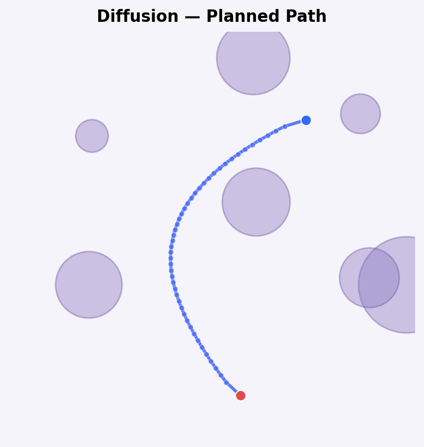
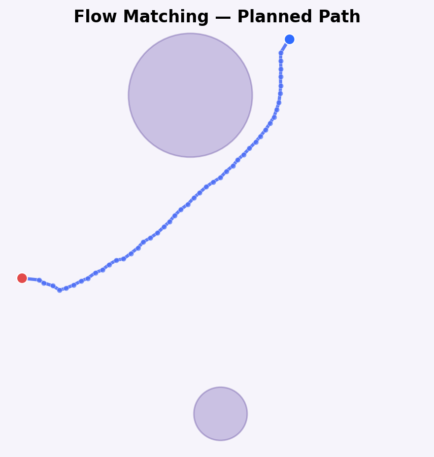
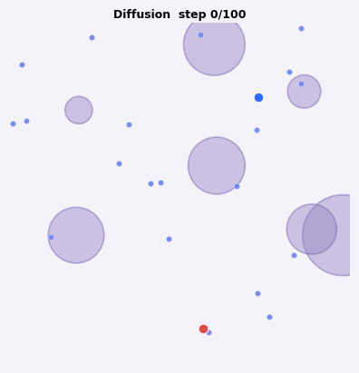
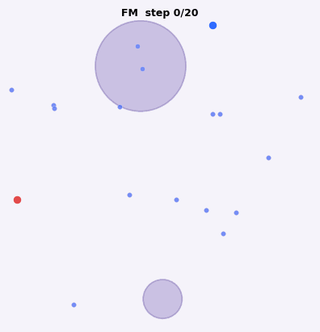

# Diffusion Path Planning in 2D

**2D trajectory generation using generative models**, producing smooth and collision-free paths in environments with circular or rectangular obstacles.

Two generative backbones are supported:

| Model | Algorithm | Train script |
|-------|-----------|--------------|
| DDPM | Denoising Diffusion Probabilistic Model | `train_continuous.py` |
| Flow Matching | Conditional Flow Matching (ODE-based) | `train_fm.py` |

Two environment modes are supported:

| Mode | Map | Obstacle type | Encoder |
|------|-----|---------------|---------|
| `original` | 8×8 binary grid | Rectangles | ViT + MLP |
| `continuous` | 64×64 3-channel image | Circles (continuous space) | CNN |

## Results

|  DDPM | Flow Matching |
|------|---------------|
|  |  |

### Inference process

| DDPM denoising | Flow Matching ODE |
|----------------|-------------------|
|  |  |

## Model Architecture


The pipeline has two inputs: the **environment map** and a **noisy trajectory**.

- The 64×64 3-channel map (ch0 = obstacles, ch1 = start blob, ch2 = goal blob) is encoded by a **CNN** into a fixed-size embed feature vector.
- A **noisy trajectory** (pure Gaussian noise for DDPM; random x₀ for Flow Matching) enters the network as a sequence of 2D waypoints.
- A **conditional 1D U-Net** takes the noisy trajectory and uses the CNN embed as a global FiLM condition to iteratively refine it into a clean path.

The two backbones share the same network and conditioning — they differ only in training objective and inference loop.

### DDPM
- Iterative denoising over 100 timesteps (DDPM scheduler)

### Flow Matching
- Learns a velocity field between noise and data distributions
- Straight-line conditional flow: `x_t = (1−t)·x₀ + t·x₁`
- Inference: Euler ODE integration (20 steps)

### Environment conditioning

**Original mode**
- **MLP** encodes concatenated start + goal positions
- **ViT** encodes the 8×8 binary obstacle grid
- Both embeddings concatenated → global FiLM conditioning

**Continuous mode**
- Start and goal embedded as **Gaussian blobs** in map channels 1 and 2
- **CNN** encodes the full 3-channel 64×64 map
- No separate MLP branch

## Data Generation

Expert trajectories are generated offline using a custom **RRT\*** planner and saved as `.npy` datasets.

### RRT\* planner

| Variant | Obstacle type | Class |
|---------|--------------|-------|
| `RRTStar` | Circular obstacles (continuous space) | `data_generator/RRT_star.py` |
| `RRTStarGrid` | Rectangular obstacles (occupancy grid) | `data_generator/RRT_star_grid.py` |

Both support optional post-processing:

- **Prune** (`prune=True`) — shortcut pruning: greedily removes intermediate waypoints reachable by line-of-sight
- **Smooth** (`smooth=True`) — spline smoothing on the pruned path; falls back to linear interpolation if the spline clips an obstacle

### Multiprocessing generation

`DataGenerator2D` uses `multiprocessing.Pool` with a map-reduce pattern — each worker independently samples a random (start, goal, obstacles) triple and runs RRT\*, using all CPU cores in parallel.

## Training

**DDPM (continuous mode)**
```bash
python train_continuous.py
```

**Flow Matching**
```bash
python train_fm.py
```

Both scripts:
1. Generate (or load) the dataset via RRT\* with multiprocessing
2. Train the conditional U-Net with periodic visual evaluation
3. Save checkpoints to `ckpt/` and intermediate plots to `intermediate_results[_fm]/`

Key hyperparameters live in `config/plane_continuous.py` (DDPM) and `config/plane_fm.py` (FM). Set `GENERATE_DATA = True` at the top of each script to force dataset regeneration.

## Evaluation

**DDPM**
```bash
# Set MODE = "continuous" or "original" at the top of test_diffusion.py
python test_diffusion.py
```

**Flow Matching**
```bash
python test_fm.py
```

**Visualization**
```bash
python generate_viz.py
```

Outputs `res/` — process GIFs, final path images, and environment-only plots.

## Requirements

```bash
pip install -r requirements.txt
```
