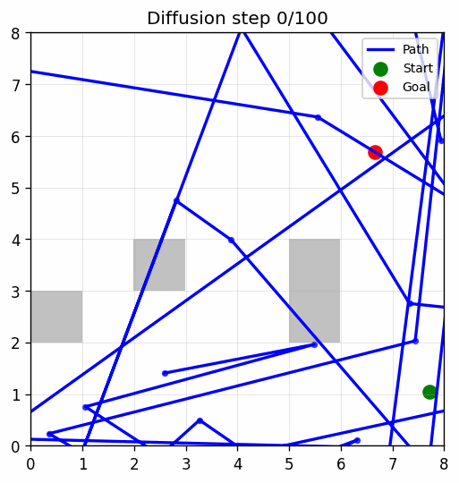
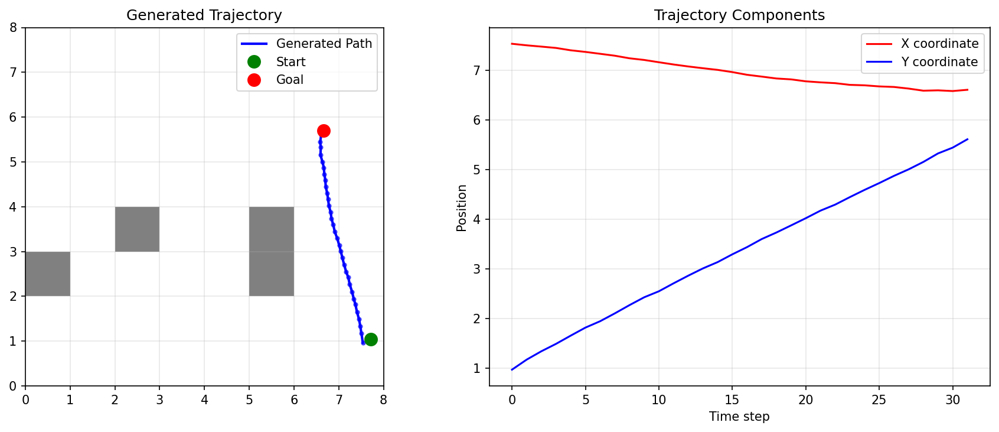

# Diffusion Path Planning in 2D

This project demonstrates **2D trajectory generation using a conditional diffusion model**, capable of producing smooth and collision-free paths in environments with or without obstacles.

##  Results

| No Obstacle | With Obstacle |
|-------------|----------------|
|  |  |
|  |  |

Things to note: in our dataset, we do not have scenarios with only one obstacle or with no obstacles at all. Therefore, the examples we show are situations that the model has absolutely never seen before.

##  Model Architecture

A **conditional diffusion model** for 2D path planning. The core components are:

-  **Start & Goal Encoding**  
  The start and goal positions are concatenated and passed through a **Multi-Layer Perceptron (MLP)** to produce a compact feature embedding.

-  **Map Encoding**  
  An **8×8 binary obstacle map** is encoded using a **Vision Transformer (ViT)** to extract spatial features and obstacle distributions.

-  **Trajectory Prediction (Conditional U-Net)**  
  The denoising process operates over the action sequence (trajectory) using a **1D U-Net** conditioned on both:
  - The MLP-encoded start-goal feature
  - The ViT-encoded map feature

This design enables the model to iteratively refine the noisy trajectory into a valid path.

## Dataset

We generate expert trajectories using a **custom RRT\*** planner. The dataset consists of:

- Start & goal coordinate pairs  
- Obstacle maps (8×8 binary grids)  
- Ground truth paths from RRT\*

## Continue
To do

